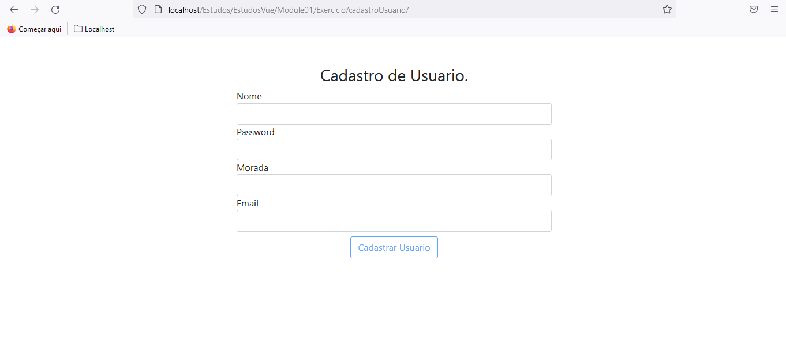
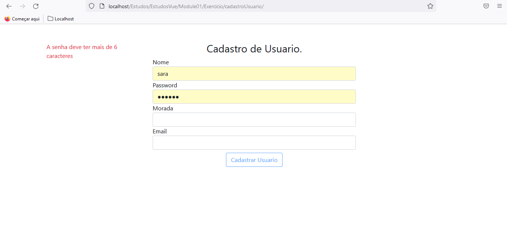

## Cadastro de Usuario - PHP and Vuejs

 

        Este é um pequeno projecto usando <strong>PHP</strong>,para fazer o cadastro de usuario, usando o <strong>VUE.js</strong> para fazer a validação no lado front end, e usando o 
        <strong>Jquery</strong> para fazer chamadas de ajax.
 

 

<ul>Estrutura do Projecto:
        
   * **bootstrap** - Onde tem os arquivos de bootstrap para estizar o projecto.

  * **db.php** - Arquivo que faz a inserção de dados na base de dados 
  * **index.php** - Arquivo onde se encontra a instancia Vue,e aporta de entrada da aplicação.
  * **jquery.min.js** - Lib js usada para a consulta de ajax.  

</ul>

   

    <h2>Screem<h2>

 
  

   
